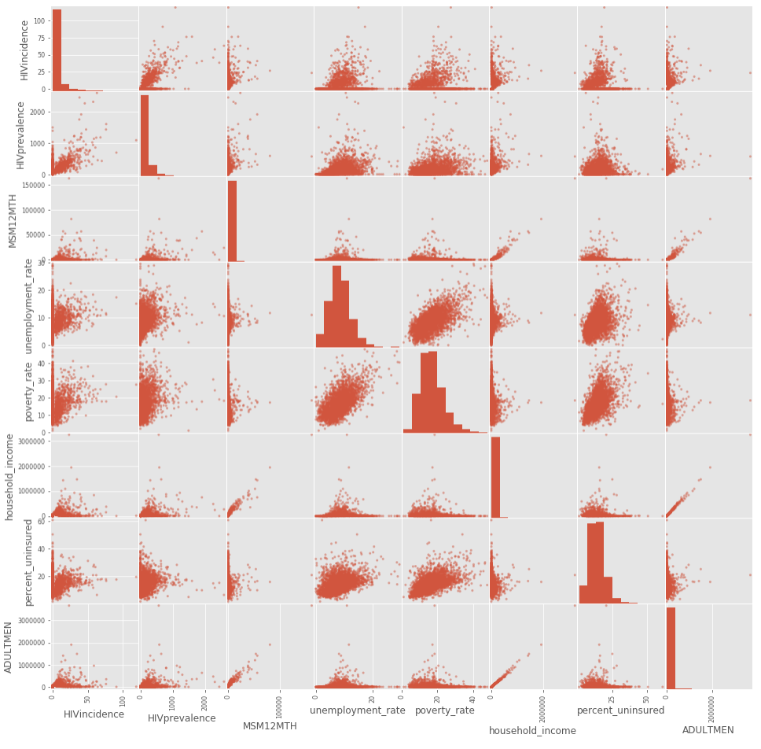
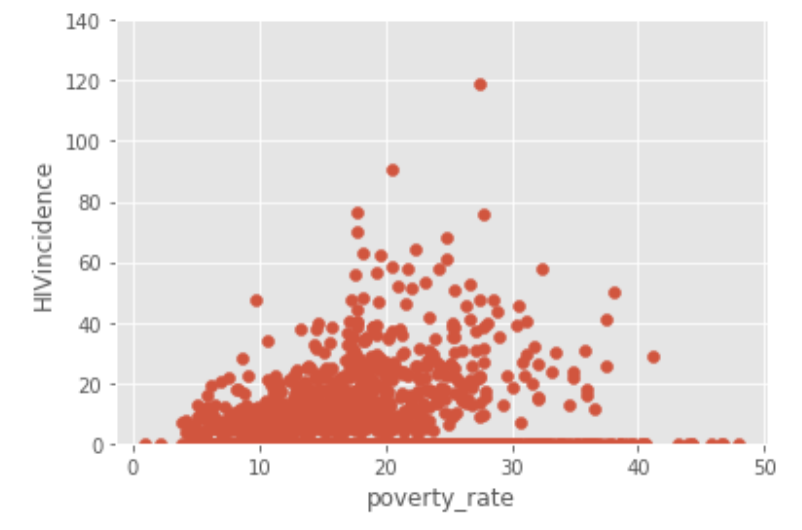
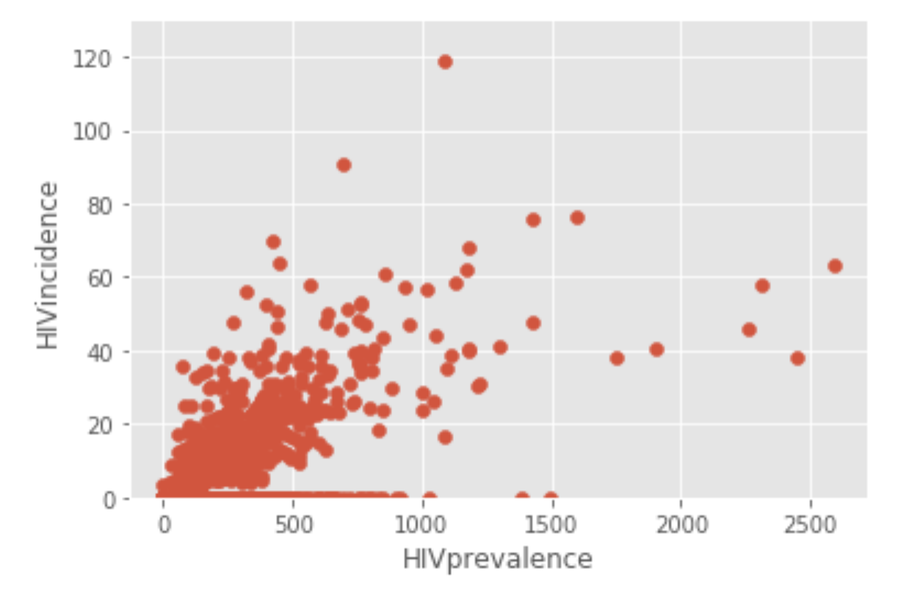

# hiv_incidence_analysis
To model HIV incidences and identify features that are drivers of HIV 

To understand the correlation between HIV incidence and the other features, we ran a scatter matrix as shown below.

Taking a closer look, here are scatter plots of drug dependency, household income, poverty, prevalence, and unemployment.

In future work, we would like to do some feature engineering with HIV prevalence.  The prevalence tends to fan out so we would like to transform the data with a log function to tighten the data.

